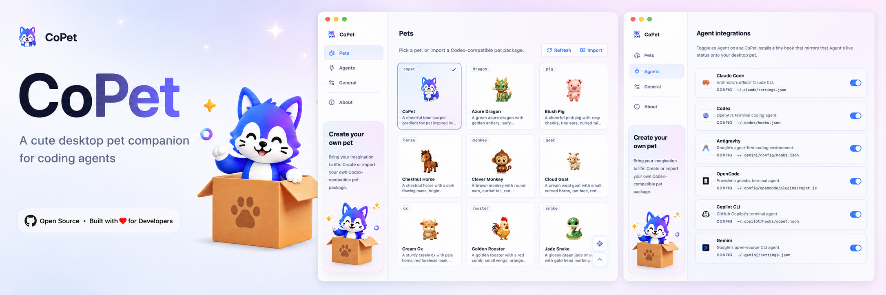

[简体中文](./README.zh.md)

A desktop companion driven by Codex pet packages that reacts in real time to your AI Agent CLI sessions — Claude Code, Codex, Antigravity, OpenCode, Copilot CLI, and Gemini.

Built with Tauri, Rust, and React. Lightweight, local-first, no cloud.

## Features

- Real-time pet reactions to Agent prompts, tool use, waiting, completion, and errors.
- Integrations for Claude Code, Codex, Antigravity, OpenCode, Copilot CLI, and Gemini.
- Built-in pets plus import support for Codex-compatible pet packages.
- Rich pet interactions: hover, click, double-click, rapid-click petting, long-press, drag reactions, and native context menu.
- Global and per-pet sound packs for interactions and Agent states.
- Settings and tray controls for pets, Agent hooks, sounds, language, visibility, and window position.
- Local-first data model in `~/.copet`, with safe hook backups, atomic writes, and no telemetry.
- Bilingual UI (English / 简体中文).

## Supported agents

| Agent | Integration | Default config path |
| --- | --- | --- |
| Claude Code | JSON hooks | `~/.claude/settings.json` |
| Codex | JSON hooks + trusted hook hashes | `~/.codex/hooks.json`, `~/.codex/config.toml` |
| Antigravity | JSON hooks | `~/.gemini/config/hooks.json` |
| OpenCode | JS plugin + config entry | `~/.config/opencode/plugins/copet.js`, `~/.config/opencode/opencode.json` |
| Copilot CLI | JSON hook file | `~/.copilot/hooks/copet.json` |
| Gemini | JSON hooks | `~/.gemini/settings.json` |

## Getting started

Prerequisites: [Rust](https://www.rust-lang.org/tools/install), [Node.js](https://nodejs.org/) with pnpm. Runs on macOS (primary), Windows, and Linux.

```bash
git clone https://github.com/ChanceYu/CoPet.git
cd CoPet
pnpm install
pnpm tauri:dev          # development
pnpm tauri:build        # production bundle
```

## Project layout

- `src-tauri/` — Rust core, agent adapters, runtime server.
- `src/` — React frontend (pet window + settings center).
- `src-tauri/assets/pets/` — built-in pet packages bundled with the app.
- `src-tauri/assets/sounds/` — built-in global sound packs bundled with the app.
- `skills/` — optional CoPet Skill docs for generating pets and 11-clip sound packs.
- `docs/architecture.md` — technical architecture and design.
- `AGENTS.md` — contributor guide and testing instructions.

## Security

- Event server binds only to `127.0.0.1`, requires a bearer token, rate-limits requests, and drops unknown payloads.
- All hook config changes are backed up before write and use atomic file ops.
- Pet and sound packages are treated as untrusted data and validated before use.
- `assetProtocol.scope` whitelists exactly which pet, sound, preview, and bundled resource directories the webview can read.

## Contributing

Issues and PRs welcome. Start with [AGENTS.md](AGENTS.md) for setup and conventions, and [docs/architecture.md](docs/architecture.md) for the system design.

## License

[MIT](LICENSE) © ChanceYu
