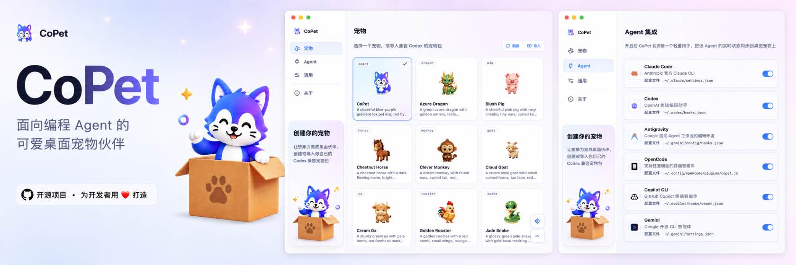

<div align="center">
  
  <h1>CoPet</h1>
  <p><strong>由 Codex pet 包驱动的 AI Agent 桌面伙伴。</strong></p>
  <p>实时响应 Claude Code、Codex、Antigravity、OpenCode、Cursor、Copilot CLI、Pi、Gemini 会话，把提示、工具调用、等待和完成状态变成陪你写代码的灵动宠物反馈。</p>
</div>



[English](./README.md)

基于 Tauri、Rust、React 构建。轻量、本地优先、无云依赖。

## 功能

- 实时响应 Agent 提示、工具使用、等待、完成和错误。
- 内置 Claude Code、Codex、Antigravity、OpenCode、Cursor、Copilot CLI、Pi、Gemini 集成。
- 内置宠物，并支持导入 Codex 兼容宠物包。
- 丰富宠物互动：悬停、单击、双击、快速连击、长按、拖拽反应和原生右键菜单。
- 支持全局音效包与随宠物携带的交互 / Agent 状态音效。
- 设置页与托盘覆盖宠物、Agent hooks、音效、语言、可见性和窗口位置。
- 本地优先数据模型，数据位于 `~/.copet`，hook 写入有备份、原子写且无遥测。
- 双语界面（English / 简体中文）。

## 自定义你的宠物

CoPet 不止内置宠物。[CoPet Skill 系列](./skills/README.md) 可以把角色设定、团队或个人头像变成你自己的桌面伙伴：

- [`copet-gen`](./skills/copet-gen/SKILL.md) 生成并安装自定义 CoPet 宠物包，包含 `pet.json` 与 `spritesheet.webp`，让你的角色响应 Agent 活动。
- [`copet-sound`](./skills/copet-sound/SKILL.md) 生成配套 11 段 MP3 音效包，覆盖点击、互动、等待、成功和错误等状态。

安装 CoPet Skills 到 Codex，可任选一种方式。

在终端中运行：

```bash
npx skills add ChanceYu/CoPet --skill '*' -a codex -g -y
```

在 Codex 会话中输入：

```text
$skill-installer install all CoPet skills from https://github.com/ChanceYu/CoPet/tree/main/skills
```

如果新安装的 Skill 没有出现，请重启 Codex。

## 支持的 Agent

| Agent | 集成方式 | 默认配置路径 |
| --- | --- | --- |
| Claude Code | JSON hooks | `~/.claude/settings.json` |
| Codex | JSON hooks + 可信 hook 哈希 | `~/.codex/hooks.json`, `~/.codex/config.toml` |
| Antigravity | JSON hooks | `~/.gemini/config/hooks.json` |
| OpenCode | JS 插件 + 配置入口 | `~/.config/opencode/plugins/copet.js`, `~/.config/opencode/opencode.json` |
| Cursor | JSON hooks | `~/.cursor/hooks.json` |
| Copilot CLI | JSON hook 文件 | `~/.copilot/hooks/copet.json` |
| Pi | TypeScript 扩展 | `~/.pi/agent/extensions/copet/index.ts` |
| Gemini | JSON hooks | `~/.gemini/settings.json` |

## 安装

| 平台 | 下载 |
| --- | --- |
| macOS（Universal） | [CoPet-macos-universal.dmg](https://github.com/ChanceYu/CoPet/releases/latest/download/CoPet-macos-universal.dmg) |
| Windows x64 | [CoPet-windows-x64.exe](https://github.com/ChanceYu/CoPet/releases/latest/download/CoPet-windows-x64.exe) |

[全部 Releases](https://github.com/ChanceYu/CoPet/releases)

### macOS

把 `CoPet.app` 拖入 `/Applications`。构建未公证，安装后执行一次以下命令解除 quarantine：

```bash
sudo xattr -rd com.apple.quarantine /Applications/CoPet.app
```

### Windows

Windows 构建未做代码签名，首次启动可能触发 SmartScreen 警告——点击 *更多信息* → *仍要运行*。

## 快速开始

环境要求：[Rust](https://www.rust-lang.org/tools/install)、[Node.js](https://nodejs.org/) 与 pnpm。支持 macOS（主要平台）、Windows、Linux。

```bash
git clone https://github.com/ChanceYu/CoPet.git
cd CoPet
pnpm install
pnpm tauri:dev          # 开发模式
pnpm tauri:build        # 构建发行版
```

## 项目结构

- `src-tauri/` — Rust 核心、Agent 适配器、运行时事件服务器。
- `src/` — React 前端（宠物窗口与设置中心）。
- `src-tauri/assets/pets/` — 应用打包的内置宠物包。
- `src-tauri/assets/sounds/` — 应用打包的内置全局音效包。
- `skills/` — 可选 CoPet Skill 文档，用于生成宠物与 11 段式音效包。
- `docs/architecture.zh.md` — 技术架构与设计文档。
- `AGENTS.md` — 贡献者指南与测试说明。

## 安全

- 事件服务器仅绑定 `127.0.0.1`，必须携带 bearer token，带限流，未知 payload 直接丢弃。
- 所有 hook 配置改写在写入前备份原始字节，并采用原子写。
- 宠物包与音效包都按不可信数据处理，使用前先校验。
- `assetProtocol.scope` 严格白名单 webview 可读的宠物、音效、预览与内置资源目录。

## 贡献

欢迎 Issue 与 PR。先阅读 [AGENTS.md](AGENTS.md) 了解开发环境与约定，[docs/architecture.zh.md](docs/architecture.zh.md) 了解系统设计。

## 许可证

[MIT](LICENSE) © ChanceYu
